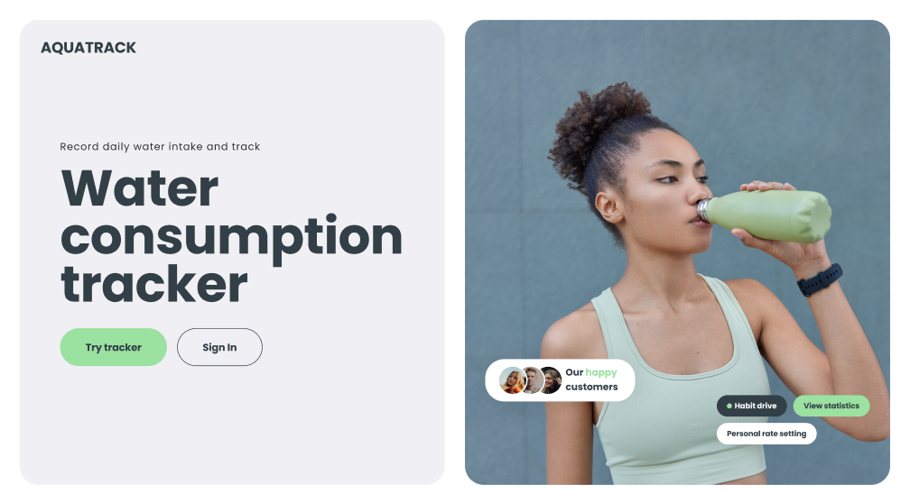
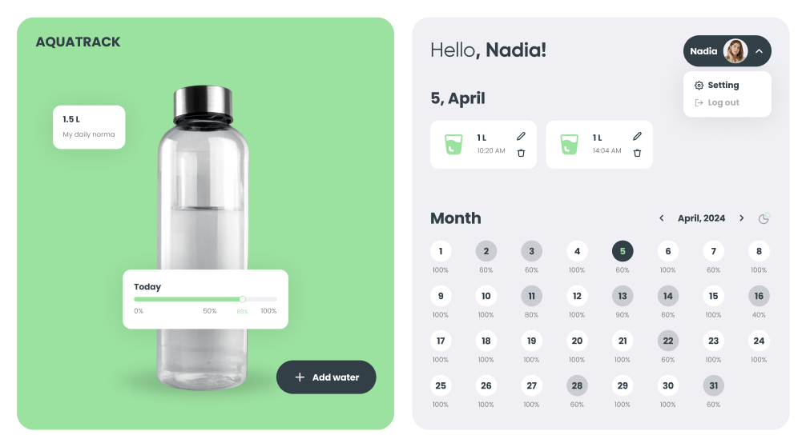
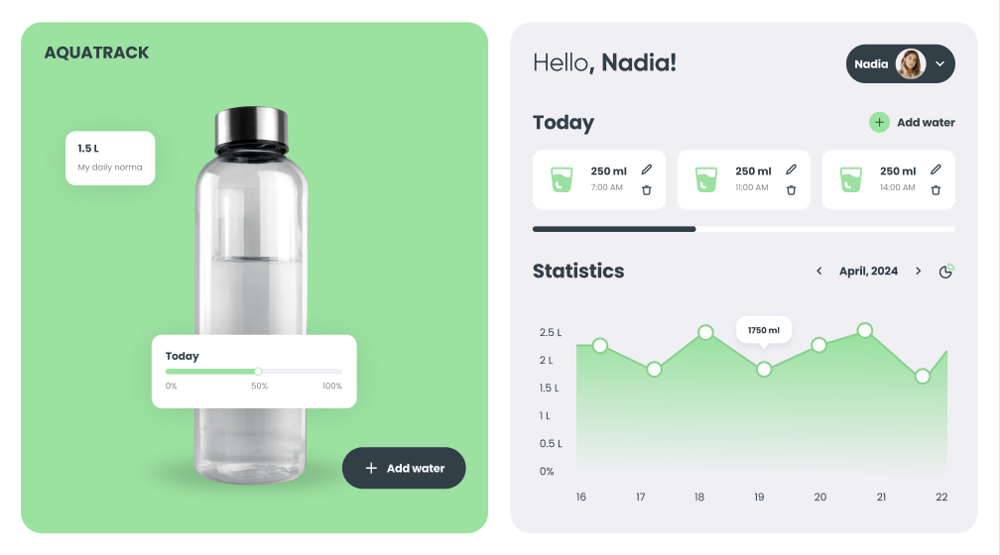
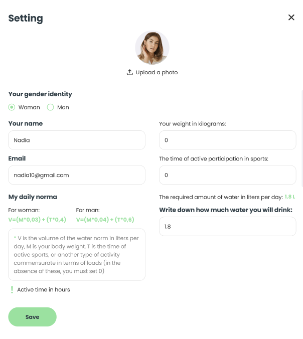

<h1 align="center">Water Tracker</h1>

## 🚰 Track Your Water Intake Effortlessly!

Welcome to Water Tracker, your go-to application for monitoring your daily water consumption. Our mission is to help you stay hydrated by making tracking your water intake easy and accessible.

### 🌟 Features

- **Responsive Design**: Enjoy a seamless experience on all devices! Our application is designed to be fully responsive, adapting perfectly from mobile (320px) to tablet (768px) and desktop (1440px).

- **User-Friendly Interface**: Easily navigate through our intuitive layout, including:
  - **HomePage**: Welcomes you and introduces the app.
  - **Sign Up / Sign In Pages**: Quick and secure access to your account.
  - **TrackerPage**: View your daily water intake and progress towards your hydration goals.

- **Smart Notifications**: Get real-time feedback on your hydration habits with notifications for both successful and erroneous submissions.

- **Modular Components**: Our app is built using reusable components, making it efficient and maintainable.

- **Internationalization Support**: The application is ready to cater to users worldwide, with multilingual support.

### 🎨 Aesthetics

- **Beautiful Typography**: We’ve carefully selected fonts for optimal readability.
- **Optimized Graphics**: All images and SVG icons are optimized for fast loading times and high-quality displays, ensuring your experience is smooth on all devices.

### 👀 Preview of Pages

<p align="center">
  
</p>
<p align="center">*HomePage: Welcome to Water Tracker*</p>

<p align="center">
  
</p>
<p align="center">*TrackerPage: Monitor Your Water Intake*</p>

<p align="center">
  
</p>
<p align="center">*TrackerPage: Monitor Your Water Chart*</p>

<p align="center">
  
</p>
<p align="center">*UserSettings: Modify Your Personal Data*</p>

### 👨‍💻 Developers

This application is crafted by a dedicated team of developers who are passionate about health and technology:

- [a-nester] - Fullstack Developer
- [AgentGarrus] - Fullstack Developer
- [ArturVayutskiy] - Fullstack Developer
- [bvv023] - Fullstack Developer
- [Kateryna-O] - Fullstack Developer
- [NataliiaSwan] - Fullstack Developer
- [NelliDiachkina] - Fullstack Developer
- [OksanaHalenko] - Fullstack Developer
- [qalibK] - Fullstack Developer
- [Tokyo772] - Fullstack Developer
- [gudzsv] - Fullstack Developer
- [Tretiak-Anna] - Fullstack Developer
- [YeVlad] - Fullstack Developer


### 🚀 Get Started

1. Clone the repository:

```bash
git clone https://github.com/gudzsv/h2o-experts-app.git
cd water-tracker
```

2. Install dependencies:

```bash
npm install
```

3. Start the application:

```bash
npm start
```
